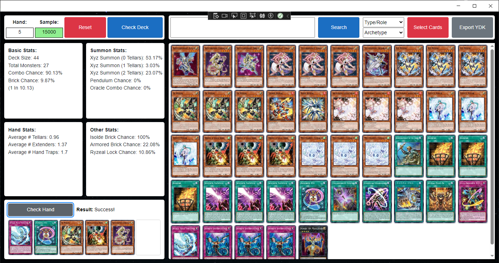

# Tellarknight App
This is an windows and android application built for the Tellarknight community for the Yu-Gi-Oh Card Game, it's used for creating Tellarknight Decklists and testing their consistency rates and other statistics to optimize deckbuilding experiences.

## Features
- Deck Statistics that calculate the chances of summoning a Rank 4 monster
- Deckbuilding with nearly 150 cards that are most commonly used with the Tellarknight Archetype.
- Indvidual Hand Tests to see the brick rate and your drawn hands.
- Card searching to easily find the cards you want to work with.
- The ability to export your decklist as a YDK file to be used with other Yu-Gi-OH services and clients.

-----

## Simplified App Overview:

### Main
- User builds their deck with the selection of cards provided.
- When the user pushes the "Check Deck" button it starts a loop that uses the card selection to build a Decklist object, which is then cloned to a fresh GameState object which contains the hand/deck/extradeck/etc.
- The loop inputs the GameState into a Card Searcher service which checks for search labled cards in your hand and then goes through several hand/deck checks to see if you have certain card combinations and available search targets before deciding on the card to be searched.
- The loop then inputs the GameState into a Hand Analyzer service that runs an override method within each card in your hand which checks for certain card combinations in your hand to set GameState.LocalStat boolean values to true.
- At the end of the Hand Analyzer, all of the booleans are converted into integers to be added to a DeckStatistics object which is not reset during each loop.
- After the loop has been done at least a few thousand times, the user is given the full statistics of their deck such as brick rate and combo chance, as well as some other helpful statistics.

