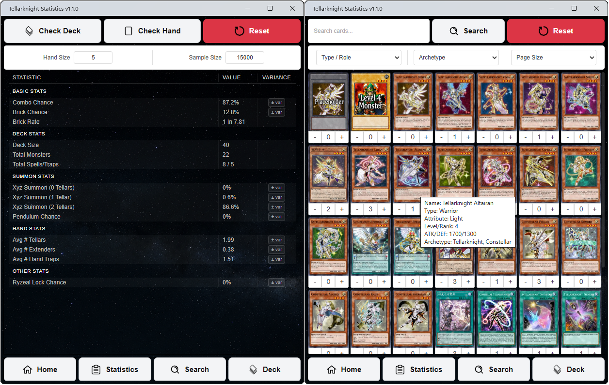

# Tellarknight App

This is a Windows and Android application built for the Tellarknight community for the Yu-Gi-Oh! Card Game. It's used for creating Tellarknight decklists and testing their consistency rates and other statistics to optimize the deckbuilding experience.

[Download The Latest Release Version](https://github.com/Metalkon/Tellarknight-App/releases)

## Features
- Deck statistics that calculate the chances of summoning a Rank 4 monster, primarily Tellarknight Constellar Caduceus and Tellarknight Constellar Delteros.
- Deckbuilding with nearly 200 cards that are most commonly used with the Tellarknight archetype.
- Individual hand tests to see the brick rate and your drawn hands.
- Card searching to easily find the cards you want to work with.
- The ability to import and export your decklist as a YDK file to be used with other Yu-Gi-Oh! services and clients.

-----

## Simplified App Overview:

### Main
- The user imports their deck or builds one from the selection of cards provided.
- When the user presses the "Check Deck" button on the Statistics page, it starts a loop that clones the built decklist into the GameState, containing the hand, deck, extra deck, and graveyard, for each run.
- Each loop passes the GameState into a Card Searcher service, which checks for "searcher" cards in your hand and runs through several hand and deck checks to see if you have certain card combinations and available search targets before deciding which card to search for and add to GameState.Hand from GameState.Deck.
- The loop then passes the GameState into a Hand Analyzer service, which runs an override method on each card in your hand to check for certain card combinations and sets the corresponding GameState.LocalStats boolean values to true.
- At the end of the Hand Analyzer, those booleans are converted into integers and added to the DeckStatistics object, which persists across the loop rather than resetting each iteration.
- After the loop has run several thousand times, the user is given the full statistics of their deck, such as brick rate and combo chance, along with other helpful statistics.

